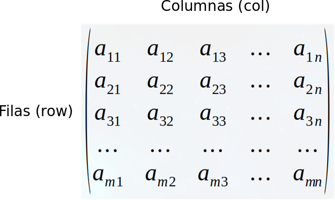

#### Matrices

Una matriz es similar a un vector pero con dimensión. Las dimensiones de una matriz son el número filas por el número de columnas.

Figura 1.- Matriz de orden m x n números dispuestod en m filas y n columnas.  

