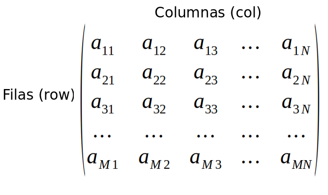

#### Matrices

Una matriz es similar a un vector pero con dimensión. Las dimensiones de una matriz son el número filas por el número de columnas.


<p align="center">

</p>
<p align="center">
Figura 1.- Matriz de orden MxN números dispuestos en M filas y N columnas.  
</p>

#### Crear Matrices
Ejemplo 1.- Se pueden crear matrices con la función `matrix()`.
```
## primer elemento = número o carácter que sera parte de la matriz
## segundo elemento = número de filas (row)
## tercer elemento = número de columnas (col)

matrix("a",2,3) ## puede contener caracteres

matrix(5,2,3) ## puede contener números

matrix(1:12,3,4) ## crea una matriz que contenga números del 1 al 12

matrix(1:12,3,4,byrow=TRUE) ## ahora los número se acomodan por filas

matrix(c("uno", "dos", "tres"),3,3) ## genera una matriz de caracteres acomodándolos por columnas

matrix(c("uno", "dos"),3,3) # la longitud de los datos tiene que ser un submúltiplo o múltiplo del número de filas
```
Ejemplo 2.- Crear matrices utilizando las función  `dim()`.
```
## a partir de un vector podemos crear una matriz
## la longitud del vector tiene que ser igual a la multiplicación de las filas por las columnas

x <- c(1,2,3,4,5,6) ## crea un vector de 6 elementos

dim(x) <- c(2,3) ## transforma el vector x a una matriz de 2x3

```
Ejemplo 3.- Crear matrices utilizando las función  `rbind()`.
```
## cada vector corresponderá a una filas

cbind(c(1,2,3),c(4,5,6)) ## crea una matriz de 2x3

## podemos crear dos vectores y unirlos por filas

vec_1 <- c(1,2,3,4)

vec_2 <- c(5,6,7,8)

rbind(vec_1, vec_2)
```

Ejemplo 4.- Crear matrices utilizando la función  `cbind()`.
```
## cada vector corresponderá a una columna

cbind(c(1,2,3),c(4,5,6)) ## crea una matriz de 3x2

## podemos crear dos vectores y unirlos por columnas

fruits <- c("Apple", "oranges", "banana")

vegetables <- c("cabbage", "spinach", "tomatoes")

cbind(fruits, vegetables)
```

#### Acceder a los elementos de una matriz
Podemos acceder a los elementos de una matriz utilizando los corchetes `[]`, poniendo primero el número de fila y en seguida el número de columna separados por una coma `var[fila, columna]`.
```
mat_ex <- matrix(1:12,3,4) ## crea una matriz 3x4

mat_ex[2,4] ## acceder al elemento de la fila 2 y columna

mat_ex[3,] ## seleccionara toda la tercera filas

mat_ex[,2] ## seleccionara toda la segunda filas

mat_ex[-2,-3] ## seleccionara toda la matriz excepto la segunda fila y la tercera columna

mat_ex[c(2,3),c(3,4)] ## seleccionara de la fila 2 a la 3 y de la columna 3 a la 4
```
