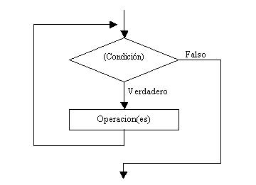
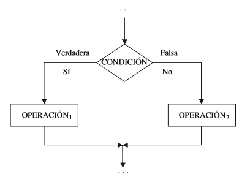

#### `for loop`

Ejemplo con datos iris:

1.- Obtener la media del ancho y largo del pétalo y pétalo

```
Sepal.Length <- mean(iris[,1])

Sepal.Width <- mean(iris[,2])

Petal.Length <- mean(iris[,3])

Petal.Width <- mean(iris[,4])
```

3.- Unir por filas cada variable

```
mean_fl <- rbind(Sepal.Length, Sepal.Width, Petal.Length, Petal.Width)
```

4.- Convertir la matriz en un dataframe
```
mean_fl <- data.frame(mean_fl)
```

En este ejemplo se realizo una acción repetitiva al calcular la media para 4 variables. Son pocas variables y repetir el código no parece algo tedioso, pero imaginate tener cientos de variables.

Cuando se nos presente este tipo de situaciones los `for loops` pueden ayudarnos a no perder tiempo copiando y pegando código.

Analicemos los datos de iris:
```
head(iris)
  Sepal.Length Sepal.Width Petal.Length Petal.Width Species
1          5.1         3.5          1.4         0.2  setosa
2          4.9         3.0          1.4         0.2  setosa
3          4.7         3.2          1.3         0.2  setosa
4          4.6         3.1          1.5         0.2  setosa
5          5.0         3.6          1.4         0.2  setosa
6          5.4         3.9          1.7         0.4  setosa

## Tenemos 5 columnas en donde las 4 primeras son las variables y la ultima corresponde a las especies.

## Obtener un vector con los nombres de las 4 variables de iris
colnames(iris[,1:4])
[1] "Sepal.Length" "Sepal.Width"  "Petal.Length" "Petal.Width"

## Obtener un vector con la posición de las 4 variables de iris
1:ncol(iris[,1:4])
[1] 1 2 3 4

## Se puede obtener la media de dos maneras

mean(iris[,1]) ## utilizando la posición de la variable

mean(iris[,"Sepal.Length"]) ## utilizando el nombre de la variable
```

Ahora que sabemos como podemos acedera a las columnas de iris podremos diseñar un `for loop` para obtener la media para cada variable y guardarlas en un dataframe.

```
## Creamos un dataframe vació para evitar sobrescribir los resultados en el loop
mean_iris <- data.frame()

## Asignamos el vector de nombres de las variables
names <- colnames(iris[,1:4])

for (i in names){  ## utilizamos el nombre de las variables en el loop

  name <- data.frame(i) ## Asignamos el nombre de la variable y lo volvemos un df

  colnames(name) <- "id" ## Cambiamos el nombre de la columna del nombre de la variable

  mean_id <- data.frame(mean(iris[,i])) ## Obtenemos la media de la variable

  colnames(mean_id) <- "mean" ## Cambiamos el nombre de la columna de la media

  df_mean <- cbind(name, mean_id) ## Unimos el nombre con la media por columnas

  mean_iris <- rbind(mean_iris, df_mean) ## Unimos los resultados por filas para evitar sobrescribir los resultados

}
```

Lo ideal seria tener las medias por variable y por especie, para obtener este resultado solo hay que modificar el `for loop`.

```
## Primero hay que obtener los nombres de las especies y asignarlos
sp_names <- levels(iris[,5])
sp_names
[1] "setosa"     "versicolor" "virginica"

## Obtener la media de la variable por especie (revisar clase tres ultima parte)
mean(iris[iris$Species == "setosa", "Sepal.Length"])
[1] 5.006

## Se pueden crear for loops dentro de otro for loop

## Creamos un dataframe vació para evitar sobrescribir los resultados en el loop
mean_iris <- data.frame()

## Asignamos el vector de nombres de las variables
names <- colnames(iris[,1:4])

for (i in names){ ## utilizamos el nombre de las variables en el loop
  for (k in sp_names){ ## utilizamos el nombre de las especies en el loop

    name <- data.frame(k, i)  ## Asignamos el nombre de la especie y de la variable y lo volvemos un df

    colnames(name) <- c("sp", "id")  ## Cambiamos el nombre de la columna de la especie y del nombre de la variable

    mean_sp <- data.frame(mean(iris[iris$Species == k, i])) ## Obtenemos la media de la variable para cada especie

    colnames(mean_sp) <- "mean"  ## Cambiamos el nombre de la columna de la media

    df_mean <- cbind(name, mean_sp) ## Unimos el nombre con la media por columnas

    mean_iris <- rbind(mean_iris, df_mean) ## Unimos los resultados por filas para evitar sobrescribir los resultados
  }
}
```

#### `while loop`

Los `while loop` se usan para repetir hasta que se cumpla una condición específica.

```
while (Condición)
{
Operación(es)
}
```

<p align="center">

</p>
<p align="center">
Figura 1.- Representación gráfica de la estructura `while loop`.
</p>

Ejemplo:
```
## Crear una variable con valor de 1
inicio <- 1

## Crear el loop
while (inicio <= 6){

  ## Crear la frase con el número de loop
  dial <- paste('Este es el loop número', inicio)

  ## Sumar 1 a la variable y comenzar después de cada ciclo
  inicio <- inicio + 1

  ## Imprimir la frase
  print(dial)
}
```

#### Estructuras de control condicionales

Este tipo de estructuras son las que incluyen alternativas de selección en base al resultado de una operación booleana (TRUE or FALSE). Según la expresión sea cierta o falsa, se ejecutará un código u otro.

`if` se usa cuando queremos que una operación se ejecute únicamente cuando la condición es verdadera.
```
if(Condición) {
  operación(es) si la condición es TRUE
}
```

<p align="center">

</p>
<p align="center">
Figura 1.- Representación gráfica de la estructura `if`.
</p>

Ejemplo:
```
if(4%%2 == 0){  ## %% devuelve el residuo de una división

  print("par") ## si el resultado es = a 0 el número es par

}
```

`else` se usa para en caso de que la condición de un verdadera no se cumpla.

```
if(condición) {
  operación(es) si la condición es TRUE
} else {
  operación(es) si la condición es FALSE
}
```

<p align="center">

</p>
<p align="center">
Figura 1.- Representación gráfica de la estructura `if - else`.
</p>
