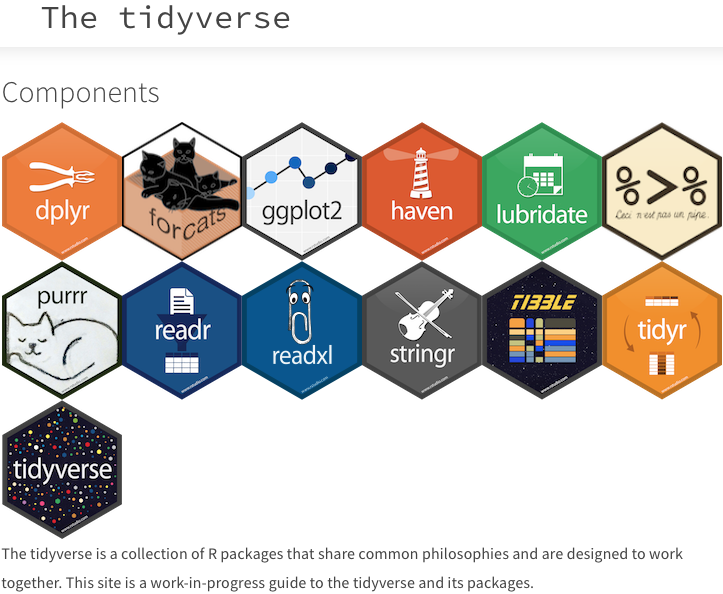

#### Funciones en R

Las funciones permiten automatizar tareas de una manera más potente y general que copiar y pegar. Escribir una función tiene grandes ventajas como:

* Asignar la función a un nombre que podemos recordar y usar para invocarla.
* Elimina la posibilidad de cometer errores incidentales al copiar y pega.
* Un conjunto definido de inputs y outputs esperados.
* Una mayor conexión con el ambiente de programación.

Estructura de una función
```
nombre_función <- function(arg_1, arg_2, ...) {
   cuerpo de la función
}
```
Ejemplo 1.- crear una función que convertir grados Fahrenheit a Celsius.
```
fahrenheit_to_celsius <- function(temp_F) {
  temp_C <- (temp_F - 32) * 5 / 9
  return(temp_C)
}
```

Ejercicio 2.- Crear un vector del 1 al número que se proporcione en la función `arg = a`, y elevar al cuadrado todos los elementos del vector.  
```
new.function <- function(a) {
   for(i in 1:a) {
      b <- i^2
      print(b)
   }
}
```
Podemos crear un nuevo `R Script` (.R file) para una función y guardala en nuestro directorio de trabajo. Posteriormente podremos llamara a la funcion con el comando `source`.
```
source(ruta/nombre_función.R)
```
Ejercicio:

1.- Guarda la función que convertir grados Fahrenheit a Celsius

2.- Utiliza la función `source` para llamarla y utilizarla.

#### R para Ciencia de Datos

El proceso de datos en R consiste en varios pasos como: importar datos, llevarlos a la estructura más conveniente, transformarlos, visualizarlos y modelarlos. Si quieres leer mas a detalle este proceso puedes visitar [R para Ciencia de Datos](https://es.r4ds.hadley.nz/).

<p align="center">

</p>
<p align="center">
Figura 1.- Diagrama que muestra el proceso en el manejo de datos en R.
</p>

La manera de realizar el procesamiento de datos en R es aprovechando la gran cantidad de paquetes que nos ofrecen rapidez y funcionalidad. [Tidyverse](https://www.tidyverse.org/) es una colección de paquetes diseñados para la ciencia de datos. Todos los paquetes comparten una filosofía de diseño, gramática y estructuras de datos subyacentes.

<p align="center">

</p>
<p align="center">
</p>

#### Manipulación de data frames con [dplyr](https://dplyr.tidyverse.org/)


Principales funciones de dplyr:
* **select**: devuelve un conjunto de columnas
* **filter**: devuelve un conjunto de filas según una o varias condiciones lógicas
* **arrange**: reordena filas de un data frame
* **rename**: renombra variables en una data frame
* **mutate**: añade nuevas variables/columnas o transforma variables existentes
* **summarise/summarize**: genera resúmenes estadísticos de diferentes variables en el data frame, posiblemente con strata
* **%>%**: el operador "pipe" es usado para conectar múltiples acciones en una única "pipeline" (tubería)

#### `select()`

La funci
