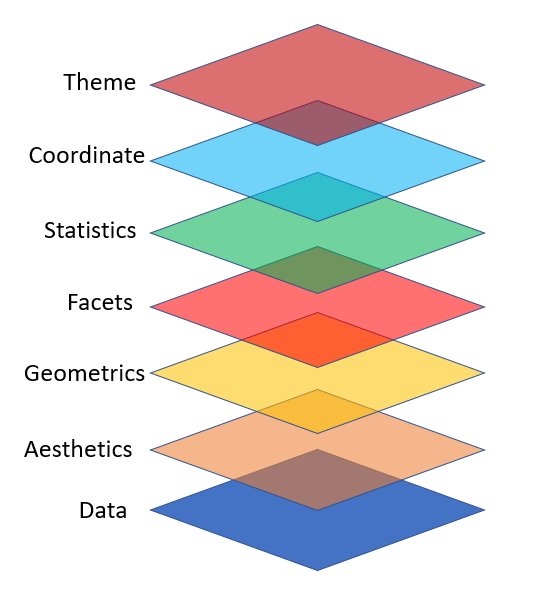

#### Visualización de datos con [ggplot2](https://ggplot2.tidyverse.org/)

ggplot2 se basa en la idea de agregar capas. La idea principal es sumar capas.

<p align="center">

</p>
<p align="center">
</p>

`data` conjunto de datos.

`aesthetics` (Características estética) describe cómo queremos que los datos se vean en el gráfico. Se utiliza la función aes() y se refieren a:
* posición (en los ejes)
* color de linea (color) y de relleno (fill)
* forma de puntos (shape)
* tipo de línea (linetype)
* tamaño (size)

`geom` (Objetos geométricos) representa lo que vemos en un gráficos (puntos, líneas, etc.). Todo gráfico tiene, como mínimo, una geometría. La geometría determina el tipo de gráfico:
* geom_point (para puntos)
* geom_lines (para lineas)
* geom_histogram (para histograma)
* geom_boxplot (para boxplot)
* geom_bar (para barras)
* geom_smooth (líneas suavizadas)
* geom_polygons (para polígonos en un mapa)
* etc.

Con estos tres argumentos podemos construir un gráfico
```
ggplot(datos, aes()) + geom_tipo()
```

A partir de esta estructura básica puede ir agregando más características a los gráficos modificando los ejes, títulos, segmentar, unir, transformaciones estadísticas, etc.

Otros elementos que conviene tener presente en un gráfico de ggplot2 son:

`stat` transformaciones estadísticas para, generalmente, resumir datos (por ejemplo: contar frecuencias, número de intervalos en los histogramas, etc.).

`scale`. convierten datos en características estéticas (colores, etc.).

`coord` sistema de coordenadas cartesianas, polares, proyecciones, etc.

`faceting` permite representar gráficos separados para subconjuntos de los datos originales.

Ejemplo básico de un gráfico de puntos con los datos iris
```
# Graficar los puntos de Sepal.Length y Sepal.Width
ggplot(iris, aes(x = Sepal.Length, y = Sepal.Width)) +
  geom_point()

# Colorear los puntos de acuerdo a las especies
ggplot(iris, aes(x = Sepal.Length, y = Sepal.Width, color = Species)) +
  geom_point()

# Cambiar la forma de los puntos de acuerdo a las especies
ggplot(iris, aes(x = Sepal.Length, y = Sepal.Width, color = Species, shape = Species)) +
  geom_point()
```

Ejemplo para modificar un gráfico de puntos añadiendo capas
```
# Cambiar el titulo de los ejes X y Y
ggplot(iris, aes(x = Sepal.Length, y = Sepal.Width)) +
  geom_point(aes(color = Species, shape = Species)) +
  xlab("Longitud de Sepalo") +
  ylab("Ancho de Sepalo")

# Otra forma de cambiar el titulo de los ejes es con la funcion labs,
# Tambien se puede agregar titulo al grafico
ggplot(iris, aes(x = Sepal.Length, y = Sepal.Width)) +
  geom_point(aes(color = Species, shape = Species)) +
  labs(title="Gráfico de la longitud y ancho de sepalo",
       x ="Longitud de sepalo", y = "Ancho de sepalo")

# La funcion theme permite cambiar el formato de las letras de los titulos.
ggplot(iris, aes(x = Sepal.Length, y = Sepal.Width)) +
  geom_point(aes(color = Species, shape = Species)) +
  labs(title="Gráfico de la longitud y ancho de sepalo",
       x ="Longitud de sepalo", y = "Ancho de sepalo") +
  theme(plot.title = element_text(color="red", size=14, face="bold.italic"),
    axis.title.x = element_text(color="blue", size=14, face="bold"),
    axis.title.y = element_text(color="#993333", size=14, face="bold"))
```
